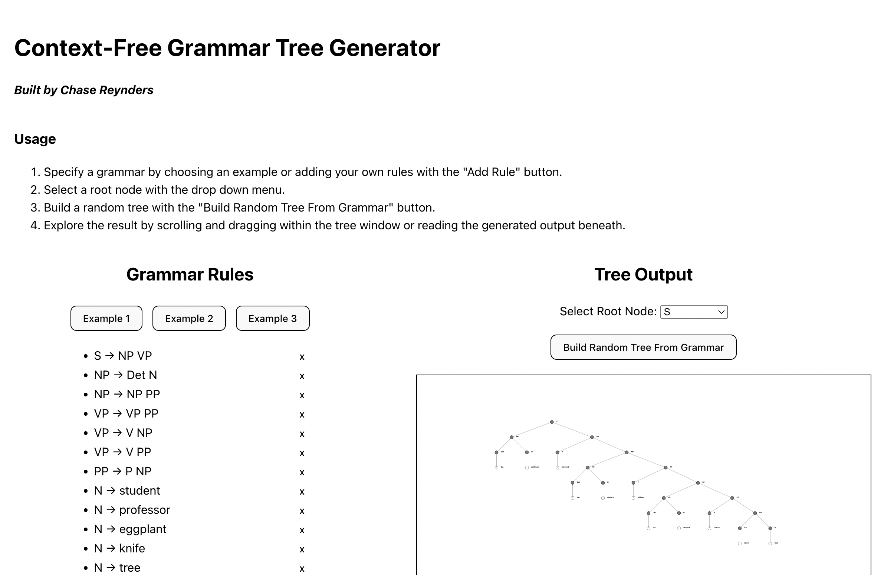
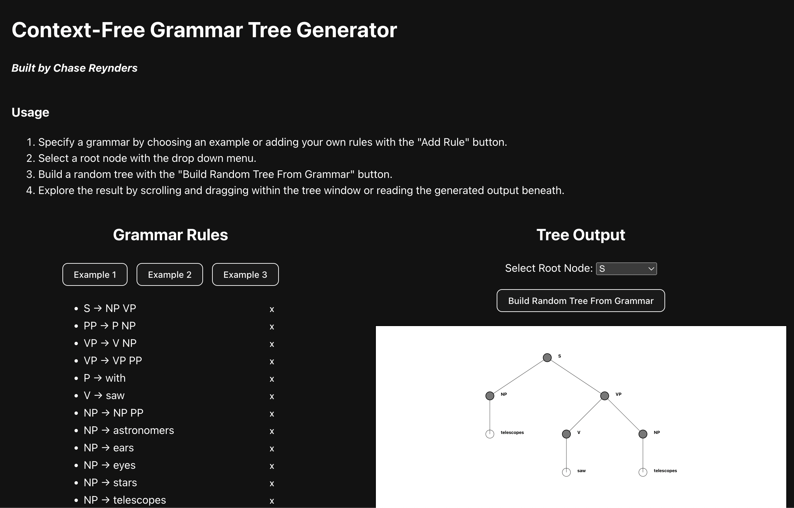
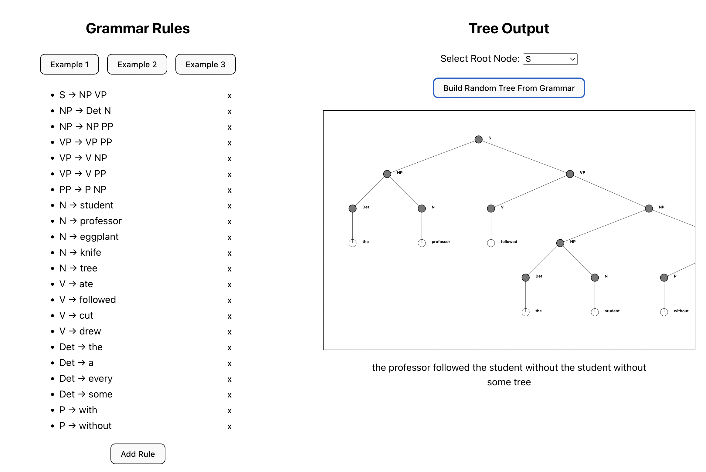
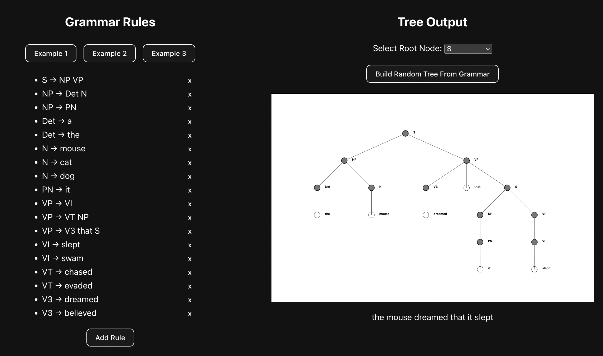

# Context-Free Grammar Tree Generator Website

Chase Reynders

## Usage

- `npm install` in the root directory to install all required dependencies
- `npm run dev` to run in development mode
- `npm run build` to bundle into HTML/CSS/JS

## Contributions

Open source project welcoming any and all PRs!

## Attributions

The first and third CFG examples were taken from the course materials of *Cognitive Science of Language* taught by Professor Bob Frank at Yale. The second CFG example was taken from the course materials of *Introduction to Computer Science* taught by Professor Stephen Slade at Yale.

## Screenshots

